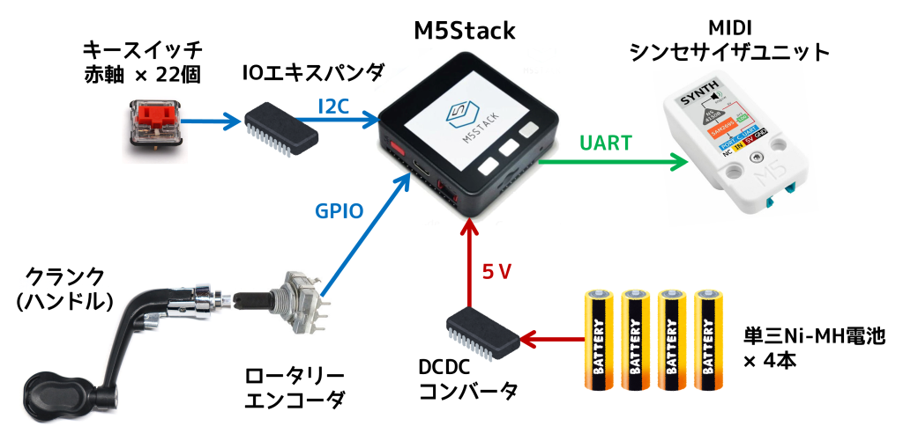

# M5Gurdy
ヨーロッパの古楽器ハーディーガーディーをM5StackとMIDI音源で再現した電子楽器

<!-- -->

## 概要

- ハンドルの回転をエンコーダで検出。
- 22個のキーにより約2オクターブの音域をカバー。
- 2本の旋律弦による旋律と、4本ドローン弦による持続音を再現。
- MIDIシンセサイザユニットでさまざまな音色を出力可能。

## 構成

- M5Stack Basic V2.7
- ソフトはPlatformIOで開発 (Arduinoベース)
- Synth Unit (M5Stack用MIDIシンセサイザーユニット)
- ロータリーエンコーダー (2相, 24パルス/回転)
- Kailh Choc V1 ロープロファイルキースイッチ (赤軸)
- MBK Choc ロープロファイルキーキャップ
- 16bit I2C I/OエキスパンダIC MCP23017
- DC/DCコンバータ イーター電機工業 AS6R0-0505 

## コンセプト
ハーディーガーディーはヨーロッパの古楽器です。バイオリンに似た弦楽器ですが、弓で弦を擦るのではなく、ハンドルでホイールを回転させて弦を擦り、旋律は鍵盤によって演奏します。またハーディガーディには、旋律弦のほかに複数のドローン弦があります。ドローン弦は一定のピッチでメロディーを伴奏し、バグパイプに似た音を生み出します。

出典：[Wikipedia](https://ja.wikipedia.org/wiki/%E3%83%8F%E3%83%BC%E3%83%87%E3%82%A3%E3%83%BB%E3%82%AC%E3%83%BC%E3%83%87%E3%82%A3)

M5Gurdyは、M5StackとMIDIシンセサイザユニットでハーディーガーディーを再現した電子楽器です。本物のハーディーガーディーと同様にハンドルと鍵盤で演奏し、2本の旋律弦と4本のドローン弦をシミュレートしますが、音色はさまざまに変えることができます。